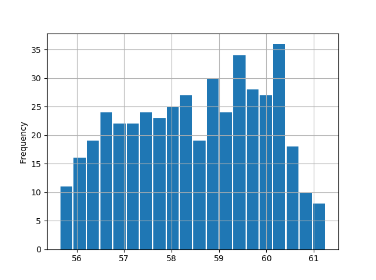
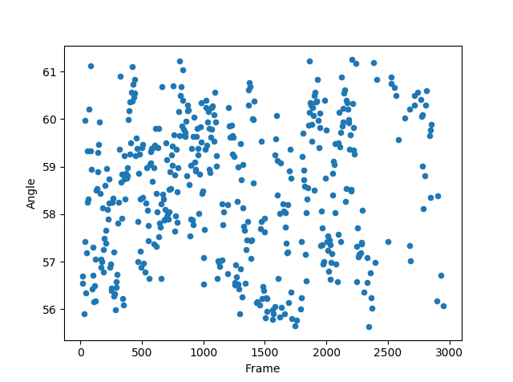

Auswertung vom 17.5.2019
=======================
Ausgangswerte:
--------------
- Durchmesser der Kugel: 5mm
- Gewicht der Kugel: -

Messung: 11.0 l/min
-------------------

| Durchschnittlicher Winkel:
| Standardabweichung:
| Bemerkung:
