Auswertung vom 5.7.2019
=======================
Ausgangswerte:
--------------
- Durchmesser der Kugel: 6.7mm
- Gewicht der Kugel: 0.0002675kg

Messung: 14.2 l/min
-------------------
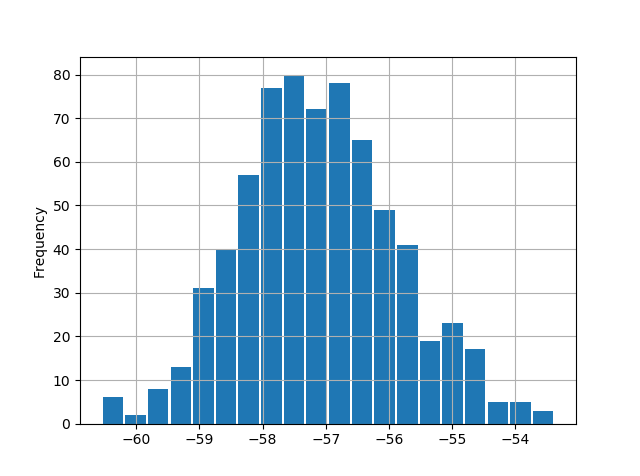

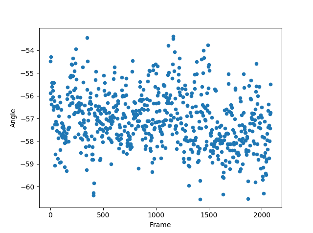

| Durchschnittlicher Winkel: 57.1064°
| Standardabweichung: 1.2484°
| Bemerkung: -

Messung: 13.45 l/min
-------------------
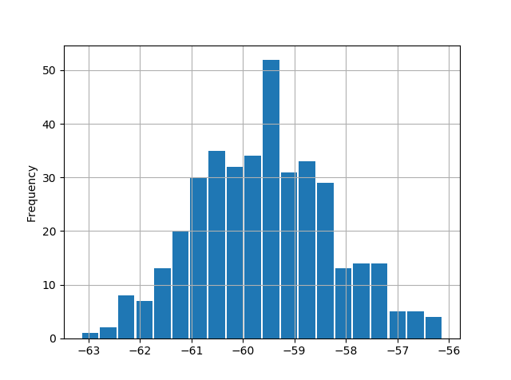

.. image:: Messungen/02-13_45/Frame_Angle.png
   :width: 45%
   :alt: In progress

| Durchschnittlicher Winkel: 59.5836°
| Standardabweichung: 1.3108°
| Bemerkung: -

Messung: 13.0 l/min
-------------------
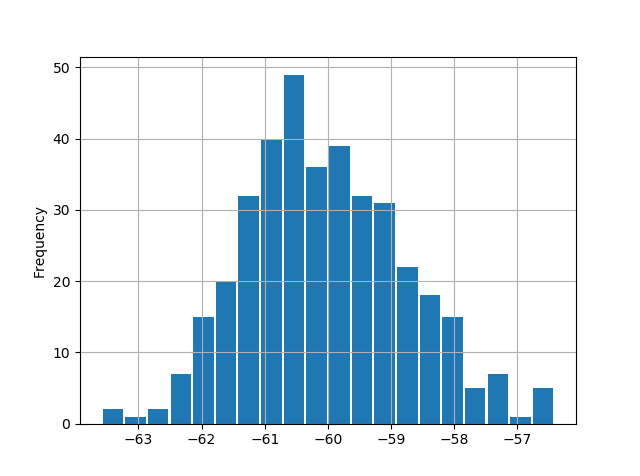

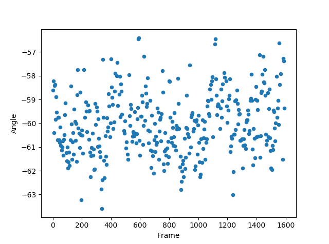

| Durchschnittlicher Winkel: 60.0342°
| Standardabweichung: 1.2779°
| Bemerkung: -

Messung: 12.0 l/min
-------------------
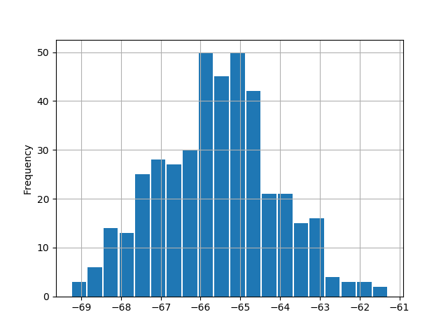

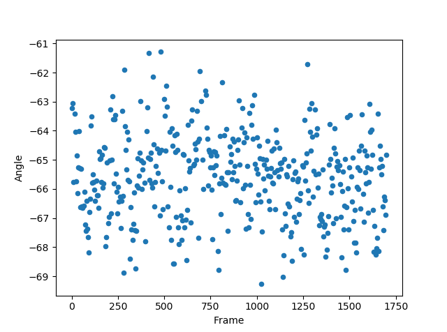

| Durchschnittlicher Winkel: 65.59499°
| Standardabweichung: 1.46727°
| Bemerkung:

Messung: 11.0 l/min
-------------------
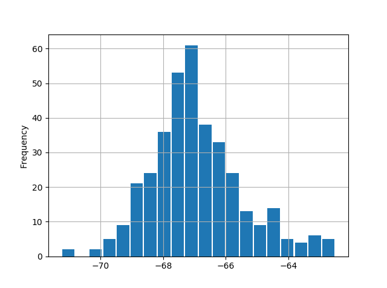

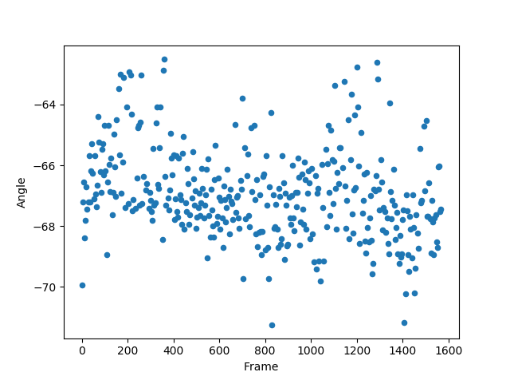

| Durchschnittlicher Winkel: 66.93894
| Standardabweichung: 1.48999
| Bemerkung: -

Messung: 10.0 l/min
-------------------
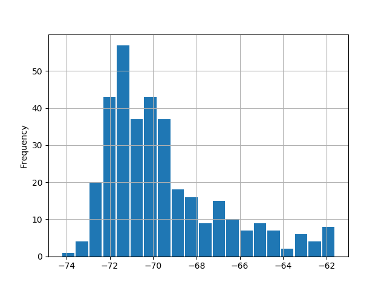

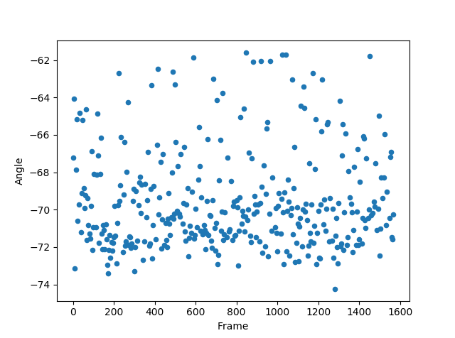

| Durchschnittlicher Winkel: 69.5425^°
| Standardabweichung: 2.6629°
| Bemerkung: Es ist eine relativ große Standardabweichung zu erkennen.

Messung: 9.0 l/min
-------------------
.. image:: Messungen/07-09_0/Histo.png
   :width: 45%
   :alt: In progress

.. image:: Messungen/07-09_0/Frame_Angle.png
   :width: 45%
   :alt: In progress

| Durchschnittlicher Winkel:
| Standardabweichung:
| Bemerkung:

Messung: 8.0 l/min
-------------------
.. image:: Messungen/08-08_0/Histo.png
   :width: 45%
   :alt: In progress

.. image:: Messungen/08-08_0/Frame_Angle.png
   :width: 45%
   :alt: In progress

Durchschnittlicher Winkel:
Standardabweichung:
Bemerkung:

Messung: 7.0 l/min
-------------------
.. image:: Messungen/09-07_0/Histo.png
   :width: 45%
   :alt: In progress

.. image:: Messungen/09-07_0/Frame_Angle.png
   :width: 45%
   :alt: In progress

| Durchschnittlicher Winkel:
| Standardabweichung:
| Bemerkung:

Messung: 6.0 l/min
-------------------
.. image:: Messungen/10-06_0/Histo.png
   :width: 45%
   :alt: In progress

.. image:: Messungen/10-06_0/Frame_Angle.png
   :width: 45%
   :alt: In progress

| Durchschnittlicher Winkel:
| Standardabweichung:
| Bemerkung:

Messung: 5.0 l/min
-------------------
.. image:: Messungen/11-05_0/Histo.png
   :width: 45%
   :alt: In progress

.. image:: Messungen/11-05_0/Frame_Angle.png
   :width: 45%
   :alt: In progress

| Durchschnittlicher Winkel:
| Standardabweichung:
| Bemerkung:

Auswertung
----------
.. image:: w_fw.png
   :width: 80%
   :alt: In progress

Vergleich
---------

