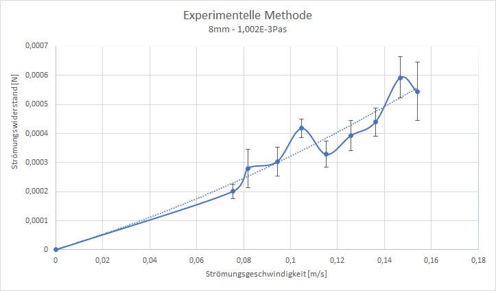

Auswertung vom 24.5.2019
=======================
Ausgangswerte:
--------------
- Durchmesser der Kugel: 8mm
- Gewicht der Kugel: 0.0003994kg

Messung: 14.7 l/min
-------------------
| Durchschnittlicher Winkel: 69.5513°
| Standardabweichung: 3.4674°
| Bemerkung: -

Messung: 14.0 l/min
-------------------
| Durchschnittlicher Winkel: 67.9016°
| Standardabweichung: 2.3784°
| Bemerkung: -

Messung: 13.0 l/min
-------------------
| Durchschnittlicher Winkel: 73.2182°
| Standardabweichung: 1.7434°
| Bemerkung: -

Messung: 12.0 l/min
-------------------
| Durchschnittlicher Winkel: 74.9219°
| Standardabweichung: 1.8946°
| Bemerkung: -

Messung: 11.0 l/min
-------------------
| Durchschnittlicher Winkel: 77.3063°
| Standardabweichung: 1.6647°
| Bemerkung: -

Messung: 10.0 l/min
-------------------
| Durchschnittlicher Winkel: 74.0029°
| Standardabweichung: 1,1721°
| Bemerkung: Weicht von den übrigen Werten ab.

Messung: 9.0 l/min
-------------------
| Durchschnittlicher Winkel: 78,2533°
| Standardabweichung: 1,9035°
| Bemerkung: -

Messung: 7.8 l/min
-------------------
| Durchschnittlicher Winkel: 79.1265°
| Standardabweichung: 2.5057°
| Bemerkung: -

Messung: 7.2 l/min
-------------------
| Durchschnittlicher Winkel: 82.1611°
| Standardabweichung: 0.986°
| Bemerkung: -

Auswertung
----------

Anmerkung: Ermittlung des Strömungswiderstandes nach dem alten Verfahren.

