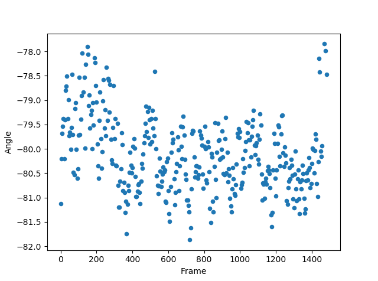

Auswertung vom 5.7.2019
=======================
Ausgangswerte:
--------------
- Durchmesser der Kugel: 6.7mm
- Gewicht der Kugel: 0.0002675kg

Messung: 14.0 l/min
-------------------

| Durchschnittlicher Winkel:
| Standardabweichung:
| Bemerkung:

Messung: 13.0 l/min
-------------------

| Durchschnittlicher Winkel:
| Standardabweichung:
| Bemerkung:

Messung: 12.0 l/min
-------------------

| Durchschnittlicher Winkel:
| Standardabweichung:
| Bemerkung:

Messung: 11.0 l/min
-------------------

| Durchschnittlicher Winkel:
| Standardabweichung:
| Bemerkung:

Messung: 10.1 l/min
-------------------

| Durchschnittlicher Winkel:
| Standardabweichung:
| Bemerkung:

Messung: 10.1 l/min
-------------------

| Durchschnittlicher Winkel:
| Standardabweichung:
| Bemerkung:

Messung: 9.1 l/min
-------------------

Durchschnittlicher Winkel:
Standardabweichung:
Bemerkung:

Messung: 7.9 l/min
-------------------

| Durchschnittlicher Winkel:
| Standardabweichung:
| Bemerkung:

Messung: 7.9 l/min
-------------------

| Durchschnittlicher Winkel:
| Standardabweichung:
| Bemerkung:

Messung: 7.0 l/min
-------------------

| Durchschnittlicher Winkel:
| Standardabweichung:
| Bemerkung:

Messung: 6.0 l/min
-------------------

.. image:: Messungen/11-06_0/Frame_Angle.png
   :width: 45%
   :alt: In progress

| Durchschnittlicher Winkel:
| Standardabweichung:
| Bemerkung:

Messung: 5.0 l/min
-------------------

| Durchschnittlicher Winkel:
| Standardabweichung:
| Bemerkung:

Auswertung
----------

Vergleich
---------

