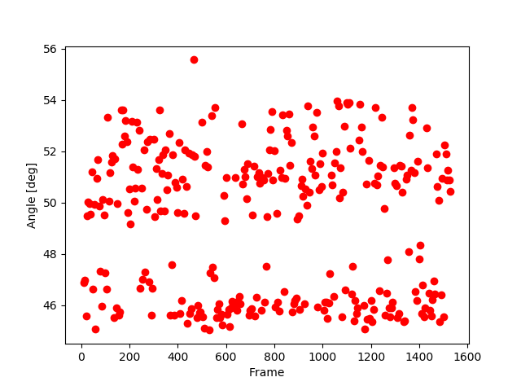
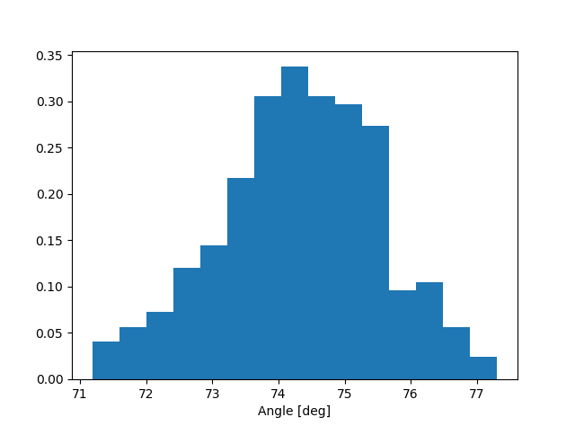

Auswertung vom 9.8.2019
=======================
Ausgangswerte:
--------------
- Durchmesser der Kugel: 8.0mm
- Gewicht der Kugel: 0.0003994kg
- Temperatur: Warm

Messung: 14.0 l/min - 2
-----------------------

| Durchschnittlicher Winkel: 58.3121°
| Standardabweichung: 1.532
| Bemerkung: NICHT IN DEN MESSERGEBNISSEN

Messung: 14.0 l/min - 2
-----------------------

| Durchschnittlicher Winkel: 60.4658°
| Standardabweichung: 1,8745°
| Bemerkung: NICHT IN DEN MESSERGEBNISSEN

Messung: 13.0 l/min
-------------------

| Durchschnittlicher Winkel: 49.2604°
| Standardabweichung: 2.84754°
| Bemerkung: Zwei Maxima, NICHT IN DEN MESSERGEBNISSEN

Messung: 12.0 l/min
-------------------

| Durchschnittlicher Winkel: 50.3081°
| Standardabweichung: 3,220°
| Bemerkung: Zwei Maxima und eine große Standardabweichung

Messung: 11.0 l/min
-------------------

| Durchschnittlicher Winkel: 57.2122°
| Standardabweichung: 1.269°
| Bemerkung: -

Messung: 10.0 l/min
--------------------

| Durchschnittlicher Winkel: 62.06928°
| Standardabweichung: 1.065598°
| Bemerkung: -

Messung: 9.0 l/min
------------------

| Durchschnittlicher Winkel: 65.0885°
| Standardabweichung: 1.0701°
| Bemerkung: -

Messung: 8.0 l/min
-------------------

| Durchschnittlicher Winkel: 68.9636°
| Standardabweichung: 1.18273°
| Bemerkung: -

Messung: 7.0 l/min
----------------------

| Durchschnittlicher Winkel: 70.4441°
| Standardabweichung: 1.3244°
| Bemerkung:

Messung: 6.0 l/min
----------------------

| Durchschnittlicher Winkel: 74.3335°
| Standardabweichung: 1.214251°
| Bemerkung: -

Messung: 5.0 l/min - 1
----------------------

| Durchschnittlicher Winkel: 76.7968°
| Standardabweichung: 0.961° 
| Bemerkung: Mit Messung *5.0 l/min - 2* zusammengelegt

Messung: 5.0 l/min - 2
-----------------------
.. image:: 05/Histo2.png
   :width: 40%

| Durchschnittlicher Winkel: 77.82875°
| Standardabweichung: 1.4451°
| Bemerkung: Mit Messung *5.0 l/min - 1* zusammengelegt

Auswertung
==========
| Auf Grund von großen Abweichungen zwischen den Messwerten wurde die Messungen folgende Messungen nicht genutzt:

- 14.0l/min - 1
- 14.0l/min - 2
- 13.1l/min

Ermittlung von a und b
----------------------

