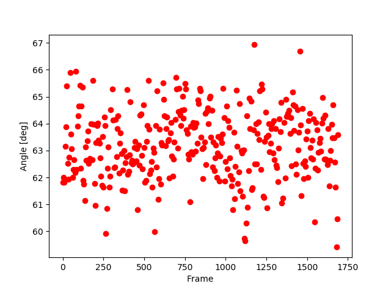
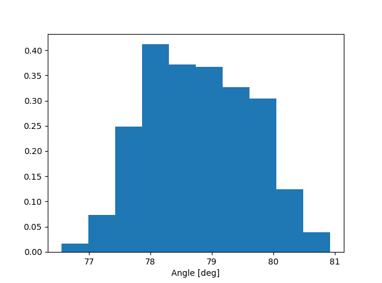
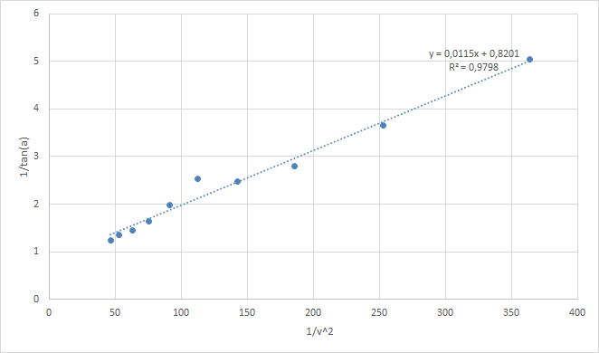

Auswertung vom 9.8.2019
=======================
Ausgangswerte:
--------------
- Durchmesser der Kugel: 8.0mm
- Gewicht der Kugel: 0.0003994kg
- Temperatur: Mittel

Messung: 13.5 l/min
-------------------

| Durchschnittlicher Winkel: 50.9513°
| Standardabweichung: 1.4344°
| Bemerkung: -

Messung: 13.0 l/min
-------------------

| Durchschnittlicher Winkel: 53.7400°
| Standardabweichung: 1.8788°
| Bemerkung: 

Messung: 12.0 l/min
-------------------

| Durchschnittlicher Winkel: 55.4507°
| Standardabweichung: 1.7467°
| Bemerkung: -

Messung: 11.0 l/min
-------------------

| Durchschnittlicher Winkel: 58.6822°
| Standardabweichung: 3.255°
| Bemerkung: -

Messung: 10.0 l/min
----------------------

| Durchschnittlicher Winkel: 63.2149°
| Standardabweichung: 1.2669°
| Bemerkung: -

Messung: 9.0 l/min
-------------------

| Durchschnittlicher Winkel: 68.9468°
| Standardabweichung: 0.7146°
| Bemerkung: -

Messung: 8.0 l/min
-------------------

.. image:: 08/Frame_Angle.png
   :width: 40%

| Durchschnittlicher Winkel: 68.0728°
| Standardabweichung: 3.0017°
| Bemerkung: -

Messung: 7.0 l/min
----------------------

| Durchschnittlicher Winkel: 70.2861°
| Standardabweichung: 2.1264°
| Bemerkung: -

Messung: 6.0 l/min
----------------------

| Durchschnittlicher Winkel: 74.6715°
| Standardabweichung: 1.2042°
| Bemerkung: -

Messung: 5.0 l/min
----------------------

| Durchschnittlicher Winkel: 78.7958°
| Standardabweichung: 0.8489° 
| Bemerkung: 

Auswertung
==========
Ermittlung von a und b
----------------------

