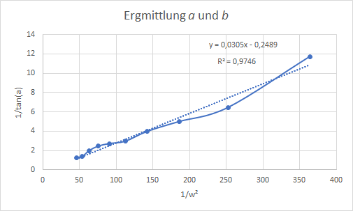
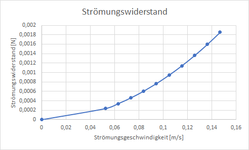

Auswertung vom 5.7.2019
=======================
Ausgangswerte:
--------------
- Durchmesser der Kugel: 6.7mm
- Gewicht der Kugel: 0.0002675kg

Messung: 14.0 l/min
-------------------
| Durchschnittlicher Winkel: 51.8786°
| Standardabweichung: 1.9466°
| Bemerkung: -

Messung: 13.0 l/min
-------------------
| Durchschnittlicher Winkel: 53.9844°
| Standardabweichung: 1.7393°
| Bemerkung: -

Messung: 12.0 l/min
-------------------
| Durchschnittlicher Winkel: 63.1866°
| Standardabweichung: 1.8953°
| Bemerkung: -

Messung: 11.0 l/min
-------------------
| Durchschnittlicher Winkel: 67.7061°
| Standardabweichung: 3.6979°
| Bemerkung: -

Messung: 10.0 l/min
-------------------
| Durchschnittlicher Winkel: 69.7482°
| Standardabweichung: 1.9957°
| Bemerkung: -

Messung: 9.0 l/min
-------------------
| Durchschnittlicher Winkel: 71.251°
| Standardabweichung: 0.8819°
| Bemerkung: -

Messung: 8.0 l/min
-------------------
| Durchschnittlicher Winkel: 75.8629°
| Standardabweichung: 1.32574°
| Bemerkung: -

Messung: 7.0 l/min
-------------------
| Durchschnittlicher Winkel: 78.6658°
| Standardabweichung: 0.8304°
| Bemerkung: -

Messung: 6.0 l/min
-------------------
| Durchschnittlicher Winkel: 81.2084°
| Standardabweichung: 0.5789°
| Bemerkung: -

Messung: 5.0 l/min
-------------------
| Durchschnittlicher Winkel: 85.1276°
| Standardabweichung: 0.6286°
| Bemerkung: -

Auswertung
==========
Ermittlung von a und b
----------------------

.. math::
    a = 0.0305
    b = -0,2498
    R^2 = 0,9746

Auswertung des Strömungswiderstandes
------------------------------------

