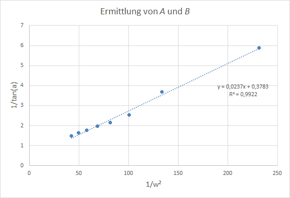

Auswertung vom 5.7.2019
=======================
|
Ausgangswerte:
--------------
- Durchmesser der Kugel: 6.7mm
- Gewicht der Kugel: 0.0002675kg
|
|
Messung: 14.0 l/min
-------------------

| Durchschnittlicher Winkel: 68.2516°
| Standardabweichung: 1.4211°
| Bemerkung: -
|
|
Messung: 13.0 l/min
-------------------

.. image:: Messungen/08-13_0/Frame_Angle.png
   :width: 40%

| Durchschnittlicher Winkel: 69.7581°
| Standardabweichung: 1.0868°
| Bemerkung: -
|
|
Messung: 12.0 l/min
-------------------

| Durchschnittlicher Winkel: 74.7275°
| Standardabweichung: 1.4655°
| Bemerkung: -
|
|
Messung: 11.0 l/min
-------------------

| Durchschnittlicher Winkel: 72.7842°
| Standardabweichung: 1.3451°
| Bemerkung: -
|
|
Messung: 10.0 l/min
-------------------

| Durchschnittlicher Winkel: 77.1512°
| Standardabweichung: 0.8202°
| Bemerkung: -
|
|
Messung: 9.0 l/min
-------------------

| Durchschnittlicher Winkel: 76.9123°
| Standardabweichung: 1.2899°
| Bemerkung: -
|
|
Messung: 8.0 l/min
-------------------
.. image:: Messungen/03-8_0/Histo.png
   :width: 40%

.. image:: Messungen/03-8_0/Frame_Angle.png
   :width: 40%

| Durchschnittlicher Winkel: 81.2122°
| Standardabweichung: 0.5726°
| Bemerkung: -
|
|
Messung: 7.0 l/min
-------------------

| Durchschnittlicher Winkel: 82.6947°
| Standardabweichung: 0.71337°
| Bemerkung: -
|
|
Messung: 6.0 l/min
-------------------

| Durchschnittlicher Winkel: 84.7111°
| Standardabweichung: 0.5933°
| Bemerkung: -
|
|
Messung: 5.0 l/min
-------------------

| Durchschnittlicher Winkel: 86.1704°
| Standardabweichung: 0.3694°
| Bemerkung: -
|
|
Auswertung
==========
Ermittlung von a und b
----------------------

|
|
Strömungswiderstand
-------------------

|
|
Vergleich
=========

